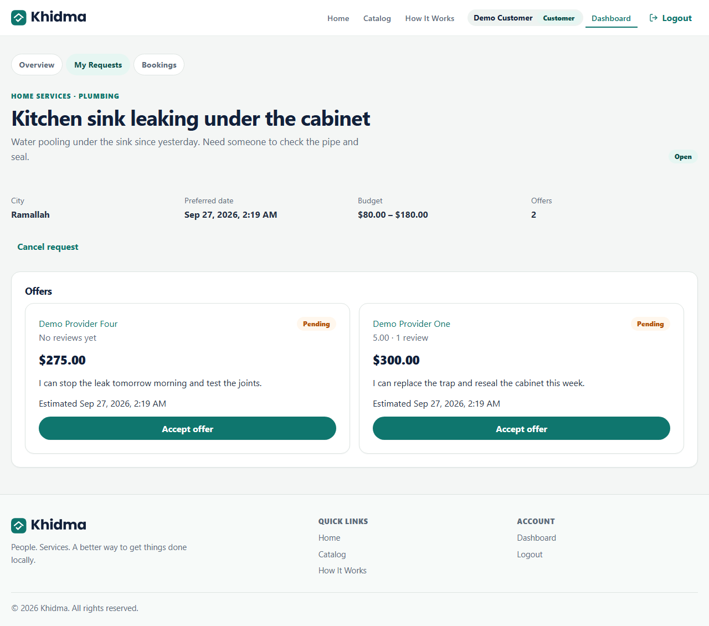
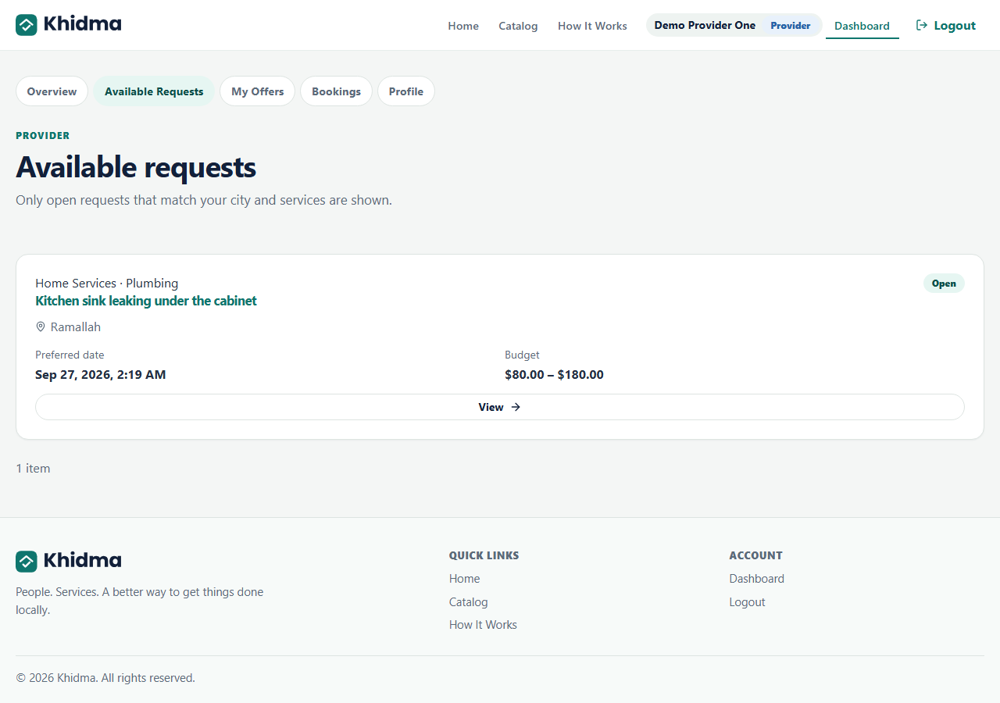
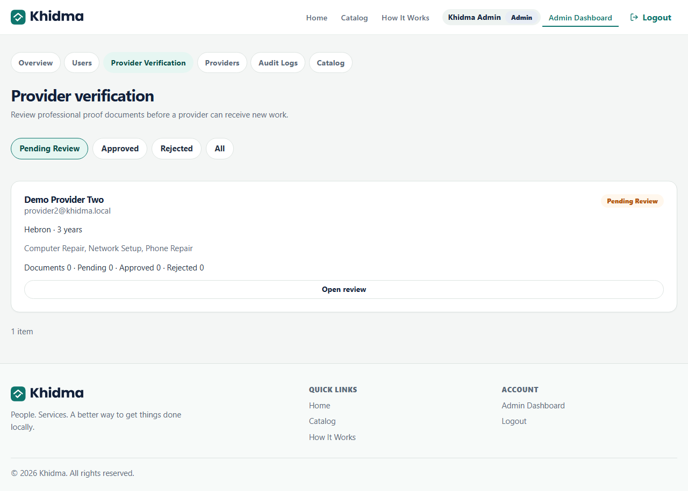
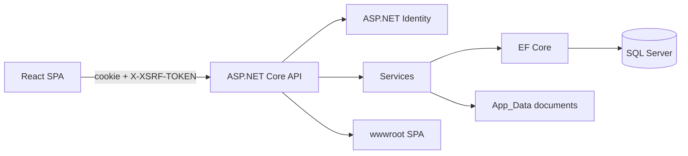
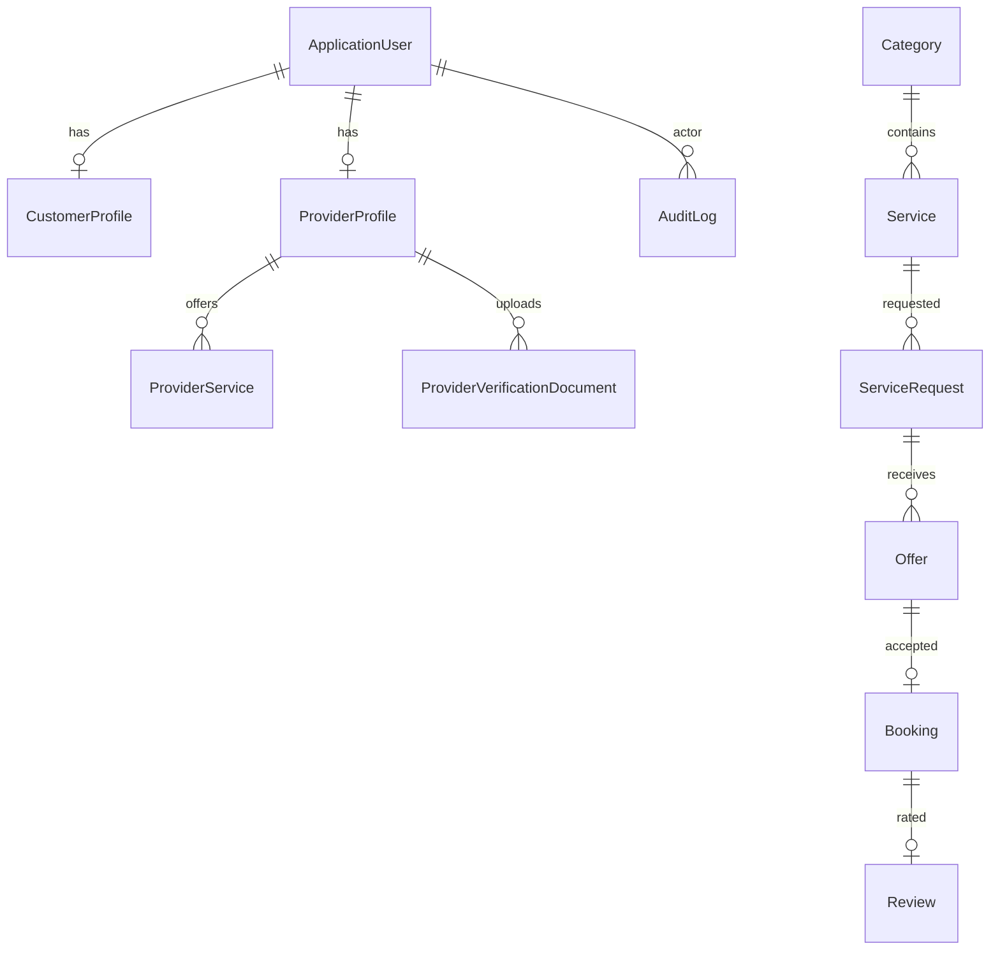

# Khidma


Khidma is a local service marketplace. Customers publish requests, eligible providers submit offers, the customer accepts exactly one offer, and the booking is started, completed, and reviewed.

**Deployed URL:** _TBD after Azure deploy_ — see `deploy/AZURE_DEPLOY.md`.

## Screenshots

Responsive captures (360 / 768 / 1280) live in [`docs/screenshots/`](docs/screenshots/). Recorded 19 September 2026 against the Vite proxy after `./scripts/reset-demo.ps1` and a demo walkthrough.








Checklist: [`docs/screenshots/README.md`](docs/screenshots/README.md).

## Stack

| Layer | Stack |
| --- | --- |
| API | ASP.NET Core 10, EF Core 10, SQL Server, Identity cookie auth + CSRF (`X-XSRF-TOKEN`) |
| Client | React 19, TypeScript (strict), Vite, React Router |
| Tests | xUnit + `WebApplicationFactory` (SQLite in-memory); opt-in SQL Server tests; Vitest + Testing Library |
| CI | GitHub Actions — jobs **Backend** and **Frontend** (`.github/workflows/ci.yml`) |

## Prerequisites (clean Windows)

- [.NET 10 SDK](https://dotnet.microsoft.com/download)
- Node.js 22 LTS and npm
- Git
- SQL Server LocalDB **or** SQL Server 2022 Developer/Express
- PowerShell 7 (`pwsh`) for smoke scripts (Windows PowerShell 5.1 also runs most of them)

If LocalDB fails with `256 misaligned log IOs` on NVMe, see **LocalDB crashes on start (Windows 11 NVMe)** below.

### LocalDB crashes on start (Windows 11 NVMe)

**Symptom.** `sqllocaldb start MSSQLLocalDB` fails. `%LOCALAPPDATA%\Microsoft\Microsoft SQL Server Local DB\Instances\MSSQLLocalDB\error.log` (this host, 18 September 2026) contains:

```text
There have been 256 misaligned log IOs which required falling back to synchronous IO.  The current IO is on file C:\Users\Anas\AppData\Local\Microsoft\Microsoft SQL Server Local DB\Instances\MSSQLLocalDB\master.mdf.
CImageHelper::DoMiniDump entered. Dump attempts: 1. Exception record exists. Exception code: 0xC00000FD
Hit Fatal Error: Server is terminating
```

`0xC00000FD` is a stack overflow in SQL Server's dump path after the misaligned IOs. This is a SQL Server 2022+ / LocalDB 17 + NVMe 32 KB physical-sector host issue, not a Khidma schema bug (ADR 22).

**Fix.** Elevated Command Prompt:

```bat
REG ADD "HKLM\SYSTEM\CurrentControlSet\Services\stornvme\Parameters\Device" /v ForcedPhysicalSectorSizeInBytes /t REG_MULTI_SZ /d "* 4095" /f
```

Then **Restart** Windows. Do not use Shut down: Fast Startup keeps kernel/stornvme state, so the registry value may not apply until a real Restart. After reboot: `sqllocaldb start MSSQLLocalDB`, then `sqlcmd -S "(localdb)\MSSQLLocalDB" -Q "SELECT @@VERSION" -C`.

**Undo:**

```bat
REG DELETE "HKLM\SYSTEM\CurrentControlSet\Services\stornvme\Parameters\Device" /v ForcedPhysicalSectorSizeInBytes /f
```

Then Restart again.

## Run on a clean Windows machine

```powershell
git clone https://github.com/AnasQalalwa/khidma.git
cd khidma
git checkout feature/full-project-development   # or main after merge

dotnet restore
dotnet tool restore

dotnet user-secrets set "ConnectionStrings:Default" "Server=(localdb)\mssqllocaldb;Database=Khidma;Trusted_Connection=True;MultipleActiveResultSets=true;TrustServerCertificate=True" --project server/Khidma.Api
dotnet user-secrets set "Seed:AdminPassword" "<admin-password>" --project server/Khidma.Api
dotnet user-secrets set "Seed:DemoPassword" "<demo-password>" --project server/Khidma.Api

dotnet ef database update --project server/Khidma.Api
dotnet dev-certs https --trust

cd client
npm ci
cd ..
```

Two terminals:

```powershell
dotnet run --project server/Khidma.Api --launch-profile https
```

```powershell
cd client
npm run dev
```

Open the Vite URL (typically `http://localhost:5173`). The Vite proxy forwards `/api` to `https://localhost:5001`.

Production-style single host (API serves `wwwroot`):

```powershell
cd client
npm run build
cd ..
dotnet run --project server/Khidma.Api --launch-profile https
```

Browse `https://localhost:5001`. Deep links such as `/customer/requests/1` return `index.html`. `/api/*` misses return Problem Details 404.

Development startup applies migrations and the idempotent seeder. Production does **not** auto-migrate: multiple instances would race, a failed migration is hard to reverse, and there is no review step. Apply `deploy/migrate.sql` instead.

## Demo credentials

Passwords come from `Seed:*` user secrets, never from git.

| Email | Role | Notes |
| --- | --- | --- |
| `admin@khidma.local` | Admin | Catalog, verification, suspension, users, audit |
| `customer@khidma.local` | Customer | Ramallah — demo pair with `provider1` / `provider4` |
| `customer2@khidma.local` | Customer | Nablus |
| `provider1@khidma.local` | Provider A | Ramallah, **Approved**, Home Services (Plumbing) |
| `provider2@khidma.local` | Provider | Hebron, **PendingReview** |
| `provider3@khidma.local` | Provider B | Bethlehem, **Approved** — ineligible for Ramallah Plumbing (direct URL **404**) |
| `provider4@khidma.local` | Provider C | Ramallah, **Approved**, Plumbing — second offer on the demo request |

## Reset local demo data

Before a live demo or capturing screenshots, drop and recreate the Development database and re-seed:

```powershell
./scripts/reset-demo.ps1
```

The script runs `dotnet ef database drop -f`, `dotnet ef database update`, then starts the API once so the Development seeder runs. Passwords stay in `Seed:*` user-secrets and are never printed. Stop any already-running API first (the script also tries to free ports 5000/5001).

## Architecture





Thin controllers parse the caller, call one service, and map `ServiceResult` to Problem Details. Eligibility is one query: `Approved` + not suspended + matching service + exact city + `Open` request.

## Tests

```powershell
dotnet build -c Release -warnaserror
dotnet test -c Release
cd client
npm run lint
npx tsc -b
npm run test
npm run build
```

SQL Server opt-in (Windows LocalDB on the machine, not the Ubuntu CI runner):

```powershell
$env:KHIDMA_SQLSERVER_TESTS = "1"
# optional: $env:KHIDMA_SQLSERVER_CONNECTION = "Server=(localdb)\mssqllocaldb;Database=Khidma_Tests;Trusted_Connection=True;TrustServerCertificate=True"
dotnet test -c Release --filter FullyQualifiedName~SqlServerIntegrationTests
```

CI stays on `ubuntu-latest` (no LocalDB). A Windows SQL job is not wired until a runner with a healthy SQL Server exists.

Current automated counts: **133** backend passed (default; **2** SQL Server skipped), **135** when `KHIDMA_SQLSERVER_TESTS=1`, **42** frontend passed. See `docs/TEST_RESULTS.md`. The backend suite includes `AdminOverviewTests`.

## Deviations from plan v2

Plan of record: [`docs/plan-v2.md`](docs/plan-v2.md).

| Added | Why |
| --- | --- |
| Professional verification **uploads** | Trust gate before `Approved` (ADR 19). Not request photos. |
| Provider **suspension** | Admin kill switch without a complaints domain (ADR 20). |
| **Audit** logging | Traceability for auth and admin trust actions (ADR 21). |
| Role **dashboard** endpoints | One round-trip for home counters (ADR 10). |

Unchanged cuts: payments, chat, notifications, maps, request photo uploads, JWT, Docker/Redis, favorites, portfolios.

CSRF failures stay **400** (ADR 17). Ineligible provider direct URLs stay **404**, not §15's 403. Demo cities stay the seeded Palestinian set.

## Known limitations

- SQLite tests cannot `ORDER BY DateTimeOffset`; lists sort by `Id`.
- SQLite filtered indexes are not SQL Server. Concurrent-accept proof is LocalDB (`scripts/concurrency-check.ps1` / `KHIDMA_SQLSERVER_TESTS=1`); both passed on this machine 18 September 2026.
- City match is exact (case-insensitive), not geographic.
- Verification files live on local disk (`App_Data`); not multi-instance. Successor: Blob Storage.
- No payments, messaging, email, or maps.

## Docs

- [`docs/plan-v2.md`](docs/plan-v2.md) — product spec
- [`docs/decisions.md`](docs/decisions.md) — ADRs
- [`docs/security-matrix.md`](docs/security-matrix.md)
- [`docs/demo-script.md`](docs/demo-script.md)
- [`docs/TEST_RESULTS.md`](docs/TEST_RESULTS.md)
- [`docs/final-test-checklist.md`](docs/final-test-checklist.md)
- [`docs/history.md`](docs/history.md)
- [`deploy/AZURE_DEPLOY.md`](deploy/AZURE_DEPLOY.md)
